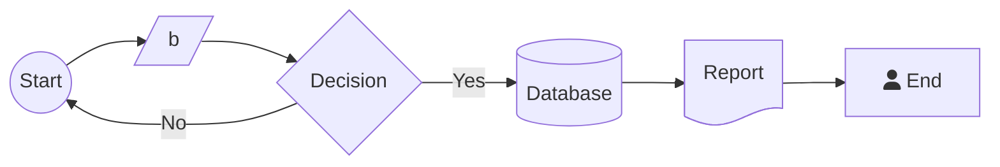

data munging recipes

```mermaid
graph LR
    B((Start))-->
    b@{shape: in-out}-->
    D{Decision}--Yes-->
    id1[(Database)]-->
    a@{ shape: doc, label: "Report" }-->
    z[fa:fa-user End]
    D--"No"-->B
```
